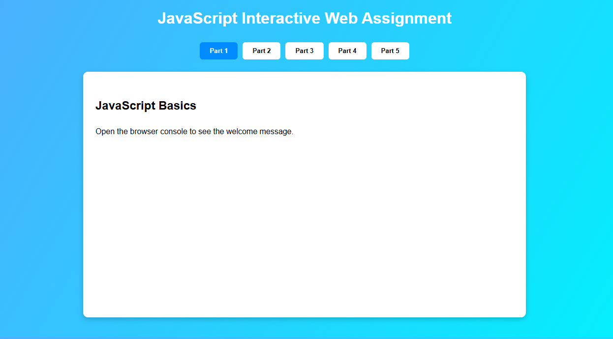
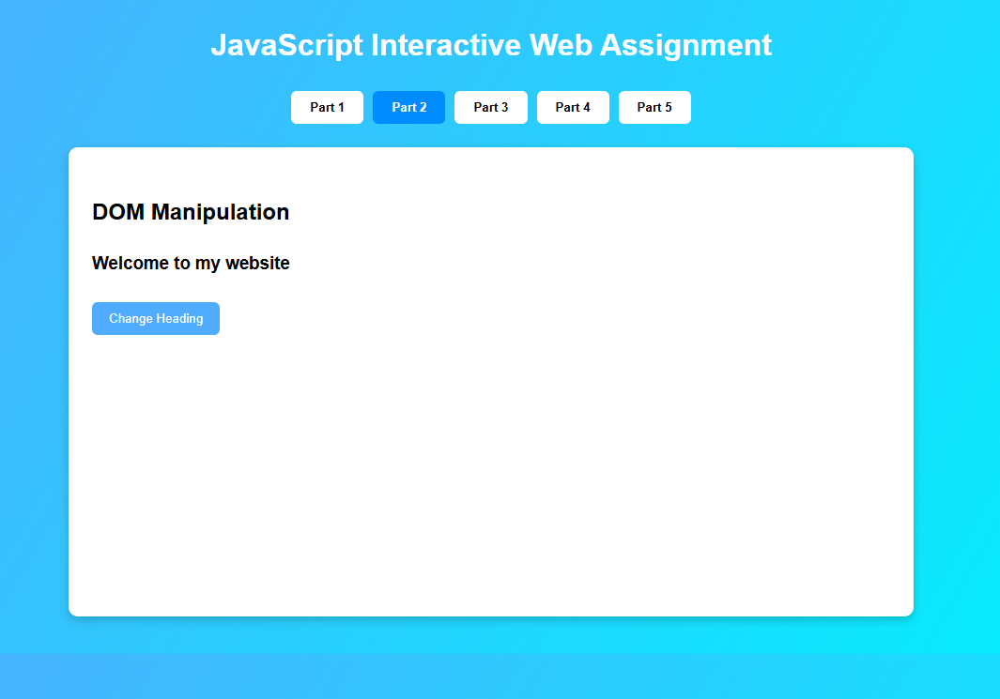
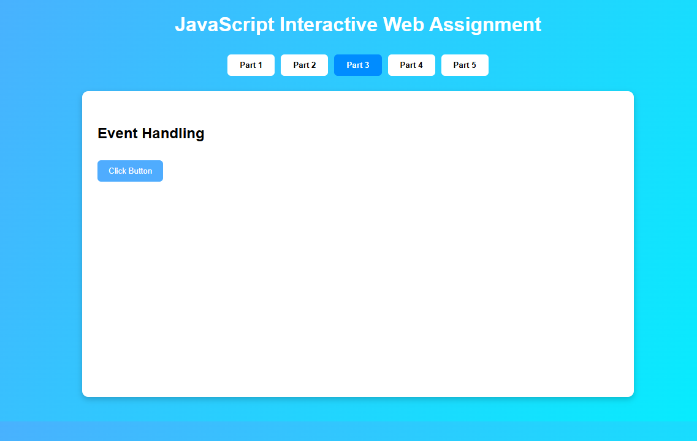
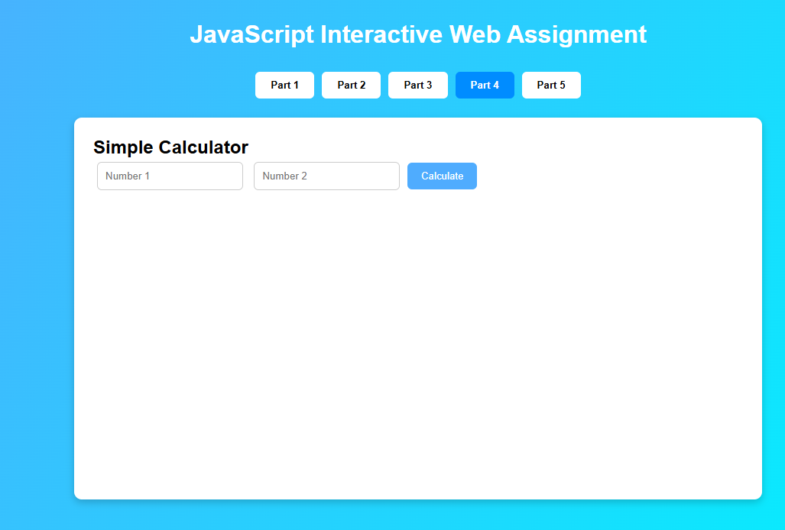
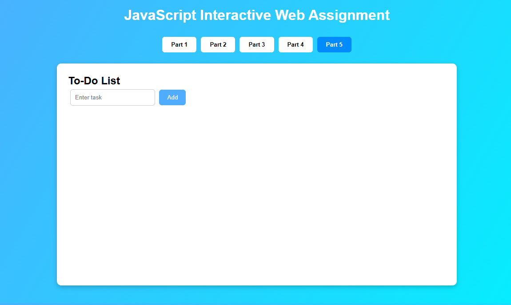

# JavaScript Interactive Web Pages Assignment (React Version)

## Project Overview
This project demonstrates how JavaScript interacts with webpages built using HTML and CSS to create interactive web features.  

**Originally implemented with pure JavaScript**, this version has been **transformed into React JS**, using components and state management to handle all interactions while preserving the original behavior and design.

The application contains multiple tasks organized using a **tabbed navigation menu**, allowing users to switch between different parts of the assignment easily.

The project demonstrates:
- JavaScript variables
- DOM manipulation
- Event handling
- Simple calculations
- Building a mini web application (To-Do List)

---

# Technologies Used

- HTML5
- CSS3
- JavaScript (React JS)

---

# Project Structure

project-folder
│
├── src
│   ├── App.jsx
│   ├── main.jsx
│   └── style.css
├── package.json
├── vite.config.js
├── README.md
└── screenshots
    ├── part1_console.png
    ├── part2_dom.png
    ├── part3_event.png
    ├── part4_calculator.png
    └── part5_todo.png


---

# How to Run the Project

1. Download or clone the project folder.
2. Ensure Node.js is installed.
3. Open a terminal in the project directory and run:

```bash
npm install
npm run dev
3. Open the local server link provided by Vite (usually http://localhost:5173) in a web browser.
4. Use the menu tabs to navigate through each part of the assignment.


---

# Features Demonstration

## Part 1 – JavaScript Basics
JavaScript variables are declared and a welcome message is printed in the **browser console**.

Example output:

Welcome Bernard to the Frontend Development course.


### Screenshot



---

## Part 2 – DOM Manipulation
A button changes the text of a webpage heading using **JavaScript DOM manipulation**.

Before clicking:

Welcome to my website


After clicking:

JavaScript is controlling this page!


### Screenshot



---

## Part 3 – Event Handling
A button triggers an event using **addEventListener()** and displays a message on the webpage.

Example message:

You clicked the button!


### Screenshot



---

## Part 4 – Simple Calculator
The calculator accepts two numbers and performs:

- Addition
- Subtraction
- Multiplication
- Division

Example:


Number 1: 10
Number 2: 5

Addition = 15
Subtraction = 5
Multiplication = 50
Division = 2


### Screenshot



---

## Part 5 – To-Do List Mini Project
The To-Do List allows users to:

- Add tasks
- Display tasks
- Remove tasks
- Mark tasks as completed

Completed tasks appear with a **line-through style**.

Example tasks:
- Study JavaScript
- Finish assignment
- Practice coding

### Screenshot



---


# Author

**Name:** NIYOMUGABO Bernard
**Reg Number:** 25RP00192
**Course:** Frontend Development  
**Institution:** Rwanda Polytechnic  Tumba College 